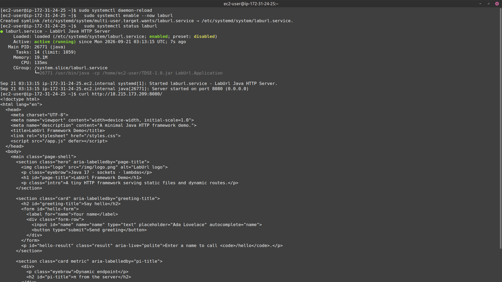
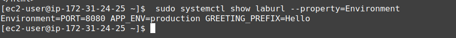
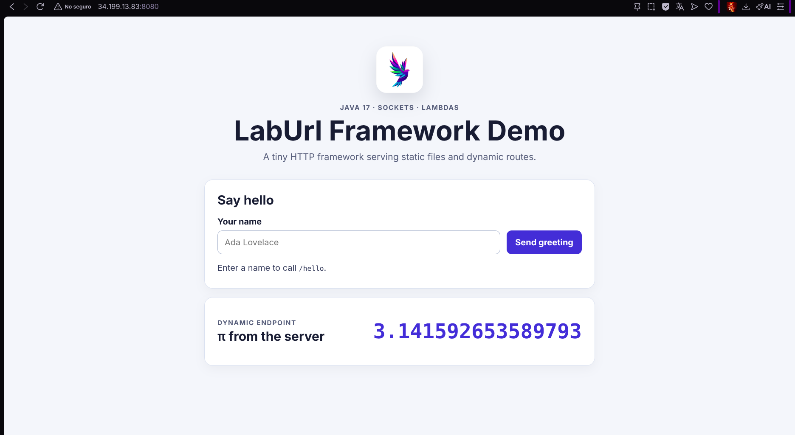
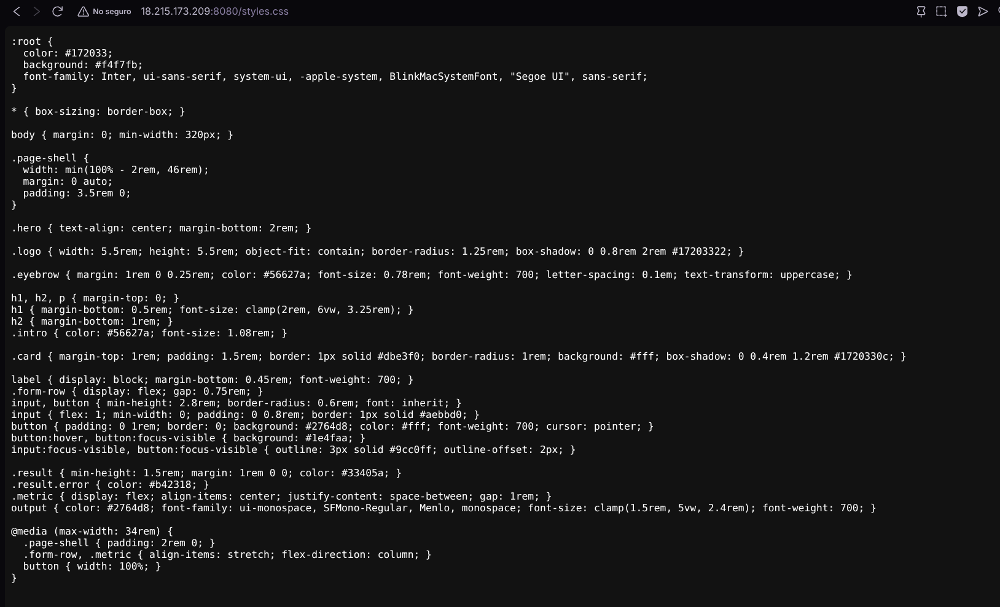
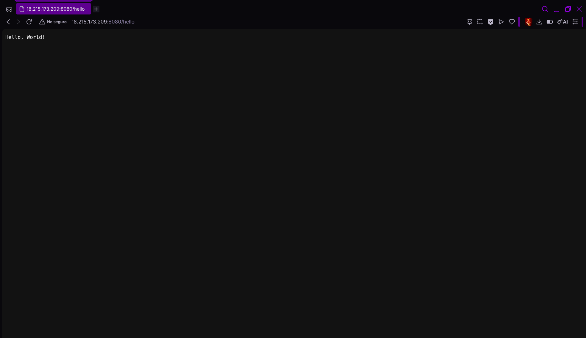
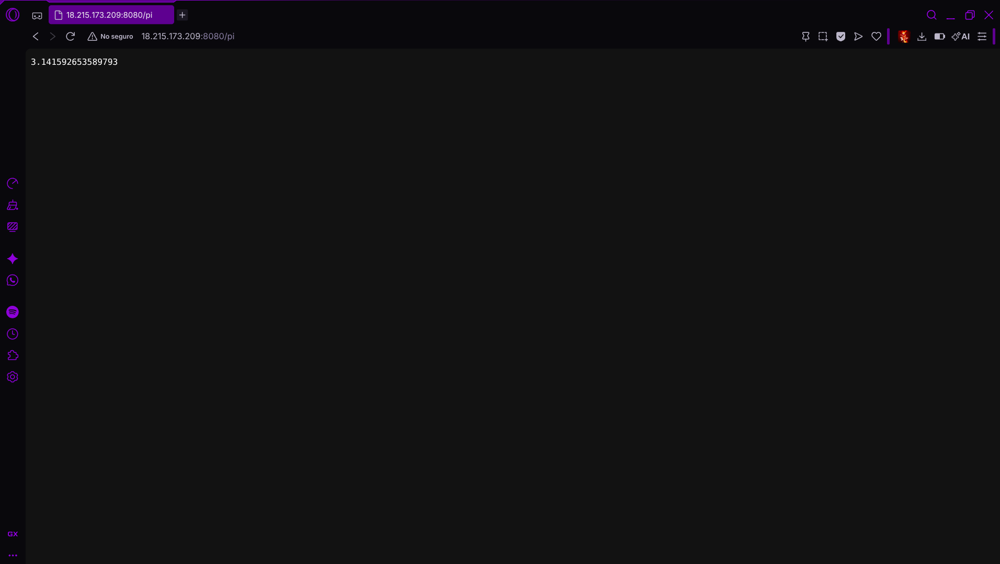
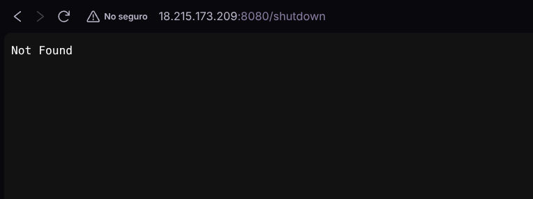
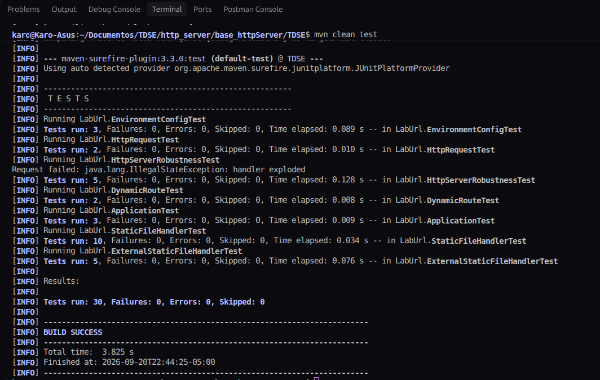
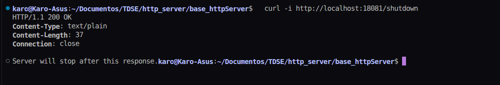
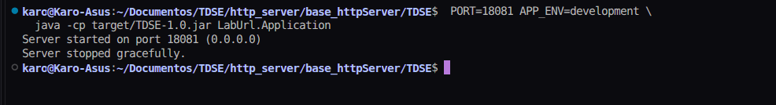

# LabUrl — minimal Java HTTP framework

## Project description

LabUrl is a small HTTP framework written in Java 17 using `ServerSocket` and Maven. It exposes a compact API to register exact `GET` routes and serve static resources. The included demonstration application serves a web page, a greeting endpoint, and a PI endpoint.

The project is intentionally educational: it shows request parsing, query-string decoding, static-file handling, HTTP status codes, environment-based configuration, and a safe development-only shutdown route.

## Architecture

```text
Browser / HTTP client
         |
         v
  HttpServer (ServerSocket, 0.0.0.0:${PORT})
         |
         +-- parses HTTP/1.1 request --> HttpRequest
         |
         +-- exact GET route? -------> registered handler --> HttpResponse
         |                                  |                    |
         |                                  +--> /hello, /pi     +--> 200
         |
         +-- static resource? -------> StaticFileHandler -------> 200
         |                                  |                    |
         |                                  +--> webroot/*       +--> MIME type
         |
         +-- neither -------------------------------------------> 404
```

### Main components and responsibilities

| Component | Responsibility |
| --- | --- |
| `LabUrl.Application` | Configures the demo application, static files, `/hello`, `/pi`, and development-only `/shutdown`. |
| `WebFramework` | Public framework API: `staticfiles()`, `get()`, `start()`, and `stop()`. Keeps the route registry. |
| `HttpServer` | Opens the socket, processes one connection at a time, dispatches `GET` requests, and emits 400, 404, or 500 when appropriate. |
| `HttpRequest` | Represents the method, path, and UTF-8-decoded query parameters. |
| `HttpResponse` | Produces text or binary HTTP responses with status, `Content-Type`, `Content-Length`, and `Connection: close`. |
| `StaticFileHandler` | Resolves and serves classpath or configured external static resources, detects MIME types, and blocks path traversal. |
| `EnvironmentConfig` | Reads and validates the environment variables used by the application. |

### Architecture metaphor: restaurant

The server is the restaurant entrance. `HttpServer` is the host who receives each customer request; `WebFramework` is the menu that maps an exact order (URL) to a cook (handler); dynamic handlers prepare made-to-order dishes such as `/hello` and `/pi`; `StaticFileHandler` is the pantry that returns prepared items such as HTML, CSS, JavaScript, and images. If neither the menu nor pantry has the request, the host returns **404 Not Found**. This separation lets each responsibility change without rewriting the others.

## Endpoints and static resources

With the application running locally on port `8080`:

| Type | URL | Expected result |
| --- | --- | --- |
| Web page | `http://localhost:8080/` | `200 OK`; the demo page. |
| Static CSS | `http://localhost:8080/styles.css` | `200 OK`, `Content-Type: text/css`. |
| Static image | `http://localhost:8080/img/logo.png` | `200 OK`, image resource. |
| REST-style endpoint | `http://localhost:8080/hello?name=Ada` | `200 OK`, `Hello, Ada!` by default. |
| REST-style endpoint | `http://localhost:8080/pi` | `200 OK`, `3.141592653589793`. |
| Missing resource | `http://localhost:8080/missing` | `404 Not Found`. |
| Development only | `http://localhost:8080/shutdown` | `200 OK` only when `APP_ENV=development`; otherwise `404`. |

Dynamic routes take precedence over static resources. Only `GET` is supported; unsupported methods and unknown paths return `404`.

## Requirements

- Java 17 or later
- Maven 3.x

## Build and run locally

Run all commands from the repository root:

```bash
cd TDSE
mvn clean package
APP_ENV=development java -cp target/TDSE-1.0.jar LabUrl.Application
```

Open <http://localhost:8080/>. To run on a different port or change the greeting:

```bash
cd TDSE
PORT=18080 APP_ENV=development GREETING_PREFIX=Hola \
  java -cp target/TDSE-1.0.jar LabUrl.Application
```

### Environment variables

| Variable | Default | Purpose |
| --- | --- | --- |
| `PORT` | `8080` | TCP port on which the server listens. It must be an integer from 1 to 65535. Cloud platforms normally provide this value. |
| `APP_ENV` | `development` | Environment selector. `/shutdown` is registered only when its value is exactly `development`. Use `production` in the cloud. |
| `GREETING_PREFIX` | `Hello` | Text prefix returned by `/hello`; e.g., `Hola` produces `Hola, Ada!`. |
| `STATIC_FILES_PATH` | Unset | Optional readable directory used instead of classpath resource directory `/webroot`. Resources cannot escape this directory. |

None of the configured variables is a secret. Do not place credentials, tokens, or private keys in this table or commit them to the repository.

## Cloud deployment

### AWS EC2 deployment

The application is deployed on an Amazon EC2 instance running Amazon Linux 2023 and Amazon Corretto Java 17. The packaged artifact is `/home/ec2-user/TDSE-1.0.jar`, and the `laburl` systemd service starts it with `PORT=8080` and `APP_ENV=production`.

- **Cloud platform:** Amazon Web Services (AWS) EC2
- **Public deployment URL:** <http://34.199.13.83:8080/>
- **Public IP:** Elastic IP `34.199.13.83`, associated with the EC2 instance
- **Runtime:** Java 17 (Amazon Corretto)
- **Service management:** `systemd` service named `laburl`, enabled to start at boot
- **Public network access:** EC2 security-group inbound rule for TCP port `8080`

The associated Elastic IP remains the same through normal EC2 stop/start cycles while it stays allocated and associated with this instance. A Learner Lab reset or policy can still stop resources or remove access.

The deployed production routes are:

```text
http://34.199.13.83:8080/
http://34.199.13.83:8080/styles.css
http://34.199.13.83:8080/img/logo.png
http://34.199.13.83:8080/hello?name=Ada
http://34.199.13.83:8080/pi
http://34.199.13.83:8080/shutdown       # returns 404 in production
```

### Reproduce the AWS EC2 deployment

1. Build the JAR locally from the repository root:

   ```bash
   cd TDSE
   mvn clean package
   ```

2. Launch an Amazon Linux 2023 EC2 instance with a key pair and a public IPv4 address. Its security group must permit SSH (TCP `22`) from the administrator's IP address and HTTP application traffic on TCP `8080`.

3. In the EC2 console, allocate an Elastic IP in the same Region and associate it with the instance. Use this stable address as `ELASTIC_IP` in the following commands.

4. Connect to the instance and install Java 17:

   ```bash
   ssh -i /path/to/key.pem ec2-user@ELASTIC_IP
   sudo dnf install -y java-17-amazon-corretto-headless
   ```

5. From the local machine, copy the built JAR to the EC2 user's home directory:

   ```bash
   scp -i /path/to/key.pem TDSE/target/TDSE-1.0.jar \
     ec2-user@ELASTIC_IP:/home/ec2-user/
   ```

6. On EC2, create `/etc/systemd/system/laburl.service` with the following content:

   ```ini
   [Unit]
   Description=LabUrl Java HTTP Server
   After=network.target

   [Service]
   Type=simple
   User=ec2-user
   WorkingDirectory=/home/ec2-user
   Environment=PORT=8080
   Environment=APP_ENV=production
   Environment=GREETING_PREFIX=Hello
   ExecStart=/usr/bin/java -cp /home/ec2-user/TDSE-1.0.jar LabUrl.Application
   Restart=on-failure
   RestartSec=5

   [Install]
   WantedBy=multi-user.target
   ```

7. Enable and verify the service:

   ```bash
   sudo systemctl daemon-reload
   sudo systemctl enable --now laburl
   sudo systemctl status laburl
   curl -i http://localhost:8080/
   ```

### Deployment evidence

All deployment captures are stored in [`docs/imgs/`](docs/imgs/). The images below show the EC2 instance, the persistent service, and the public HTTP responses.

#### EC2 service



#### Production environment configuration

The service has no secrets in its environment configuration. The following capture shows the configured port, production environment, and greeting prefix.



#### Public application and endpoints











## Verification performed locally

The following checks were run on 2026-09-20 against the current workspace.

```text
mvn test
Tests run: 30, Failures: 0, Errors: 0, Skipped: 0
BUILD SUCCESS
```

The following capture shows the full `mvn clean test` execution and successful test suite.



The application was then started with `PORT=18080`, `APP_ENV=development`, and `GREETING_PREFIX=Hola`.

| Request | Result observed |
| --- | --- |
| `GET /` | `200 OK`, `Content-Type: text/html` |
| `GET /styles.css` | `200 OK`, `Content-Type: text/css` |
| `GET /hello?name=Ada` | `200 OK`, body: `Hola, Ada!` |
| `GET /pi` | `200 OK`, body: `3.141592653589793` |
| `GET /missing` | `404 Not Found` |
| `GET /shutdown` with `APP_ENV=development` | `200 OK`, body: `Server will stop after this response.`; server stopped gracefully. |

### Development shutdown evidence

With `PORT=18081` and `APP_ENV=development`, the development-only route responds with `200 OK` and confirms that it will stop the server.



The server then ends gracefully after responding to the request.



For the production-safety check, the application was started locally with `PORT=18081` and `APP_ENV=production`:

```text
GET /shutdown -> HTTP/1.1 404 Not Found
```

This verifies the production behavior in the code path and is also confirmed by the deployed EC2 response capture
[docs/imgs/shutdown_notfound_env.png](docs/imgs/shutdown_notfound_env.png).

## Why this architecture is maintainable

Each concern has a single, small component: socket lifecycle and routing live in `HttpServer`, framework configuration lives in `WebFramework`, request parsing and response construction have dedicated classes, and static-file security is isolated in `StaticFileHandler`. The deterministic resolution order—route, static resource, then 404—makes behavior predictable and easy to test. Environment handling is centralized in `EnvironmentConfig`, so cloud-specific settings do not spread through application code.

## Test coverage by area

- `EnvironmentConfigTest` validates defaults, configured values, and invalid ports.
- `HttpRequestTest` and `DynamicRouteTest` validate query decoding, missing/repeated parameters, dynamic `GET` routing, and non-GET rejection.
- `StaticFileHandlerTest` and `ExternalStaticFileHandlerTest` validate MIME types, binary streaming, 404 responses, route priority, external resources, traversal prevention, and symlink escape prevention.
- `HttpServerRobustnessTest` validates malformed requests (`400`), missing resources (`404`), handler failures (`500`), and complete response headers.
- `ApplicationTest` validates `/hello` and `/pi`.

## Known limitations

- The server handles connections sequentially; it does not use a thread pool or asynchronous I/O.
- Routing is exact-match only and supports `GET` only.
